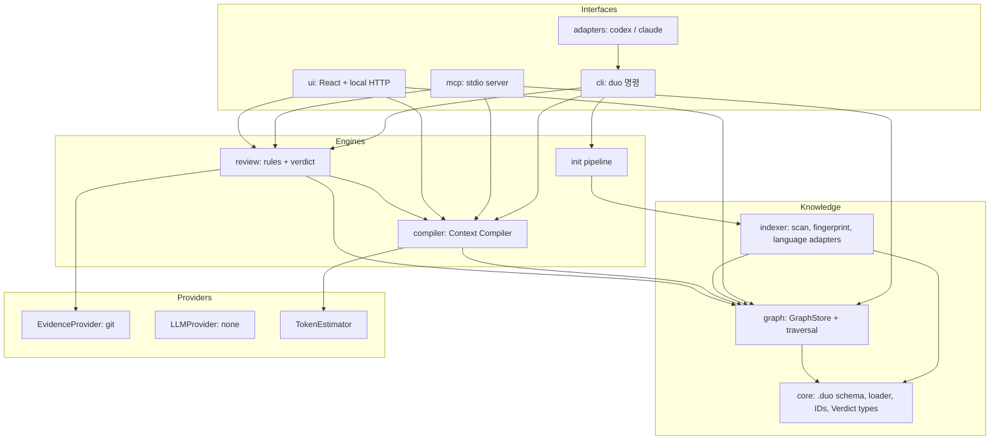

# 02. System Architecture

상태: Draft

## 계층

의존 방향은 위에서 아래로만 흐른다. `core`는 다른 패키지에 의존하지 않는다.

## 패키지

| 패키지 | 책임 | 주요 의존 |
|---|---|---|
| `core` | `.duo` 파일 스키마(zod), loader/writer, ID 규칙, Claim/Evidence/Verdict 타입, 경로 정규화 | 없음 |
| `indexer` | 파일 스캔(.gitignore 준수), fingerprint, LanguageAdapter(TS/JS), 테스트 탐지 | core |
| `graph` | GraphStore(node:sqlite), 스키마 migration, bounded traversal, 일관성 검사, 증분 갱신 | core, indexer |
| `providers` | EvidenceProvider(git), LLMProvider(none), TokenEstimator | core |
| `compiler` | Seed 해석, Subgraph 확장, 후보 표현 단계, budget packing, 지표 기록 | graph, providers |
| `review` | Diff 해석, 규칙 실행, Claim 집계, Evidence 저장, Drift 계산 | graph, compiler, providers |
| `mcp` | MCP Tool 9종, 입력 검증, freshness 보장 | compiler, review, graph |
| `adapters` | AgentAdapter(codex, claude): 설정 파일과 instruction block 관리 | core |
| `cli` | 명령 파싱, 출력 형식, UI HTTP 서버, 배포 진입점 `duo` | 전부 |
| `ui` | React 앱(빌드 결과물을 cli가 서빙) | HTTP API만 |

배포 시에는 하나의 npm 패키지로 번들한다([ADR-010](adr/ADR-010-packaging.md)).

## 확장 지점

모두 TypeScript interface로 정의하고 MVP는 괄호 안의 구현만 제공한다.

| Interface | 역할 | MVP 구현 |
|---|---|---|
| `LanguageAdapter` | 파일 → Symbol, Import, Call reference, Test | TS/JS(tree-sitter) |
| `EvidenceProvider` | 외부 근거 조회(commit, issue 상태) | git |
| `LLMProvider` | 의미 판정 요청 | none(항상 미사용) |
| `TokenEstimator` | 텍스트 → 토큰 수 | [ADR-005](adr/ADR-005-token-estimation.md) |
| `GraphStore` | Node/Edge 저장과 탐색 | node:sqlite |
| `AgentAdapter` | Agent별 설치/제거 | codex, claude |

## 주요 흐름

### duo init

~~~text
Git root 확인 ─▶ 스캔(.gitignore, 기본 제외, 비밀 파일 제외)
  ─▶ manifest / README / docs / 기획 문서 탐지
  ─▶ Git metadata(branch, HEAD, 최근 커밋 N개)
  ─▶ LanguageAdapter로 Symbol·Import·Call·Test 추출
  ─▶ 초안 작성: intent/vision.md(status: draft), constraints.yaml(빈 목록), project.yaml
  ─▶ 구현 상태 추론(state/inferred.json) · Knowledge Gap(state/gaps.json)
  ─▶ Human 확인(TTY 대화형 또는 ASK 목록 출력)
  ─▶ Graph 구축(generated/graph.db) ─▶ 요약 출력
~~~

LLM을 호출하지 않는다. 기존 기획 문서에 Requirement ID 형식(03 참조)이 있으면 가져오고, 없으면 Requirement를 만들지 않고 Knowledge Gap("Requirement 없음")으로 기록한다.

### Context 요청 (duo context, duo_get_context)

~~~text
freshness 확인(증분 인덱싱) ─▶ Seed 해석 ─▶ Subgraph 확장 ─▶ 후보 표현 ─▶ budget packing ─▶ Packet + 지표 기록
~~~

상세는 [05-context-compiler.md](05-context-compiler.md).

### Review (duo review, duo_review_changes)

~~~text
diff 수집(기본: working tree + index vs HEAD) ─▶ 변경 파일 증분 인덱싱
  ─▶ 변경 Symbol(added / modified / removed) ─▶ 영향 Subgraph(depth 2)
  ─▶ 규칙 실행 ─▶ Claim[] ─▶ Verdict 집계 ─▶ evidence/reviews/<id>.json 저장 ─▶ 출력
~~~

규칙과 집계는 [ADR-007](adr/ADR-007-verdict-model.md)에 정의한다.

## Freshness

CLI 명령과 MCP Tool은 실행 전 증분 인덱싱을 한 번 수행한다. 변경 탐지는 `git status --porcelain`, 마지막 인덱싱 commit 이후 `git diff --name-status`, 파일 stat(size, mtime) 비교, 필요한 경우에만 hash 비교 순서로 진행한다. 변경이 없으면 parse를 하지 않는다.

## 실행 형태와 동시성

| 프로세스 | 수명 | 쓰기 |
|---|---|---|
| CLI | 명령 1회 | generated/, state/, evidence/ |
| MCP 서버 | Agent 세션 동안 | 같음 + decisions/proposals/ |
| UI 서버 | 사용자가 종료할 때까지 | 없음(읽기 전용) |

SQLite는 WAL 모드로 연다. 쓰기는 `generated/.lock` 파일 잠금으로 한 프로세스만 수행하고, 잠금을 얻지 못한 프로세스는 마지막 인덱스로 읽기만 하며 출력에 `stale` 표시를 한다.

## 오류 처리 원칙

- `.duo` 파일 파싱 오류는 파일 경로와 줄 번호를 포함해 보고하고, 해당 파일만 제외한 채 계속 동작한다. 제외 자체를 Knowledge Gap으로 기록한다.
- 파싱할 수 없는 소스 파일은 File Node만 만들고 `attrs.parse_error`를 기록한다.
- Git이 없는 디렉터리에서는 init을 거부한다(v0.1은 Git Repository만 지원).
