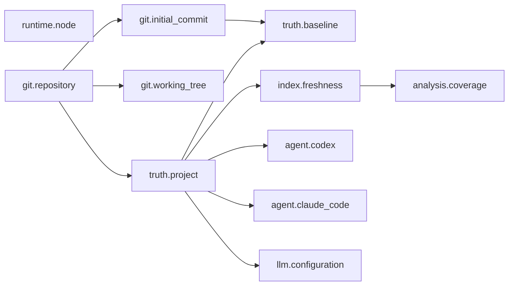

# T26.1 Doctor Core + First-run State Guidance

0.2.0 Milestone D의 첫 task다. 결정: H-58. 처음 설치했거나 무언가 안 될 때 여러 명령과 문서를 오가지 않고 현재 상태와 다음 행동을 한 번에 보게 한다. 결과: 읽기 전용 `duoctl doctor`(shared operation `projectDoctor`, payload `duo.doctor/1`), init 다음 단계 정리, ambiguous context 안내. 자동 수정은 없다.

## 1. 기존 진단·onboarding surface 감사

구현 전에 각 상태를 누가 어떤 shared operation으로 판단하는지 확인했다. Doctor는 이 operation을 그대로 조합하고 판단을 새로 만들지 않는다.

| 상태 | 기존 surface | shared operation | Doctor |
|---|---|---|---|
| Git 저장소, 최상위 | init(`planInit`), `duoctl mcp`(`serveDuoMcp`) | analyzer `openGitProvider`(`GIT_REPOSITORY_REQUIRED`, `SCAN_ROOT_INVALID`, `GIT_COMMAND_FAILED`), `findGitTopLevel` | 그대로 |
| 첫 commit | init baseline(`ADOPTION_HEAD_REQUIRED`, C214 안내) | `GitProvider.repositoryState().unborn` | 그대로 |
| 작업 트리 변경 | init(`observed.workingTree`) | director `observeWorkingTree` | 그대로(목록 없이 개수만) |
| `.duo-project`, Truth parse·schema | 모든 명령(`NOT_INITIALIZED` 5), init(partial, incompatible) | core `loadProjectTruth`, director `inspectStateDirectory` | 그대로 |
| Adoption baseline | status, init | director `getAdoptionBaselineStatus` | 그대로 |
| Index missing·current·stale·incompatible | status, context·review(`index-required`), MCP `duo_get_status` | graph `inspectIndex` | 한 번 |
| 분석 수준(L0/L1/L2) | status `analysis`(T18.0) | `inspectIndex`의 `coverage` | 같은 결과 |
| 선택 LLM | status `LLM` 줄 | integration `LLMProviderPool.forConfig` | 그대로(+ `reasonCode`) |
| Agent 설정 | `install status` | integration `inspectAgentIntegration` | 그대로 |
| Agent verify, launcher, MCP launch, tool 목록 | install verify | integration `verifyAgentIntegration`(`checkLauncher`, `probeMcpLaunch`) | `callStatus: false` |
| Runtime | `bin.js` Node 확인, `--version` | CLI `nodeVersionProblem`, `VERSION`, `NODE_ENGINE` | CLI가 값을 넘김 |
| `--help`, `--json`, 종료 코드 | 모든 명령 | `duo.cli.<command>/1` envelope, `EXIT` 0~6 | 같은 관례 |

감사에서 고친 것(C234): install verify가 tool 수를 `=== 9`로 판정했다. 이제 이 build의 `MCP_TOOLS` 이름 목록과 정확히 같아야 한다. launch 실패 detail은 공유 `redactSecrets`를 거친다. probe·verify에 `callStatus`(기본 true)를 더했다. install 출력과 `duo.agent-integration-verify/1`은 그대로다. 그 밖의 shared operation은 바꾸지 않았다. LLM factory에는 사람 문구 `reason` 옆에 stable code `reasonCode`만 더했다(`duo.status/1`에는 나가지 않음).

## 2. Check와 의존 관계

| ID | 확인 | 선행 |
|---|---|---|
| `runtime.node` | duoctl version, Node가 `>=24.15.0`인지 | 없음 |
| `git.repository` | Git work tree의 최상위인지, Git 실행 가능 | 없음 |
| `git.initial_commit` | 첫 commit, branch | `git.repository` |
| `git.working_tree` | staged·unstaged·untracked·conflicted 개수(`.duo-project`, secret 파일 제외) | `git.repository` |
| `truth.project` | `project.yaml`과 Truth 문서 parse·schema, partial, conflict | `git.repository` |
| `truth.baseline` | adoption baseline | `truth.project`, `git.initial_commit` |
| `index.freshness` | missing·current·stale·incompatible | `truth.project` |
| `analysis.coverage` | 언어별 level과 파일 수, file-only L0 | index inspection 결과 |
| `agent.codex`, `agent.claude_code` | 설정 상태, verify(launcher, MCP launch, tool 목록) | `truth.project` |
| `llm.configuration` | provider, model, credential 환경 변수 존재 | `truth.project` |



선행 check가 ok·info·warning이 아니면 뒤 check는 `skipped`(`requires`에 선행 ID)다. Git 저장소가 아닌 디렉터리는 error 하나만 보이고 나머지는 "위 단계를 마친 뒤 확인합니다" 한 줄로 모인다. 연쇄된 가짜 error는 없다. 실행은 Git 상태·baseline·index·Agent launch를 동시에 하고 결과는 위 순서로 정렬한다.

## 3. 상태 어휘, overall, 종료 코드

- 상태: `ok`, `info`(사실이나 꺼 둔 선택 기능), `warning`(동작하지만 볼 것이 있음), `error`(조치 전에는 핵심 경로가 동작하지 않음), `skipped`. Diagnostic severity(error·warning·info)와 같은 낱말이고 Review verdict(PASS/WARN/BLOCK/ASK)와는 다르다. 사람 출력은 en `ok·info·warning·error`, ko `정상·정보·주의·오류`로 소문자이며 Review의 대문자 verdict와 구별된다.
- overall: error가 하나라도 있으면 `action-required`, 없고 warning이 있으면 `warnings`, 둘 다 없으면 `ready`. 점수는 없다.
- 종료 코드(기존 `EXIT` 재사용): error 없음 0, error check 6(`ACTION_REQUIRED`), doctor 자체의 예기치 않은 실패 1(기존 CLI 오류 처리). 초기화 전도 6이다. doctor는 실행을 끝내고 문제를 보고한 것이라 "명령이 project를 요구함"의 5와 다르다. warning만 있으면 0, 연결하지 않은 Agent와 `llm.provider: none`은 info라 0이다. e2e가 0·6을 고정한다.
- 분류: stale index는 warning(동작하지만 context·review가 `index-required`), missing·incompatible은 error, baseline missing·diverged·incompatible은 warning(review는 동작하지만 기존·새 문제를 구분 못 함), 설정된 Agent의 conflict·launcher 없음·launch 실패·tool 불일치는 error, drifted는 warning, 설정된 LLM의 문제는 warning.

## 4. 결과

| 상황 | 결과 | 다음 |
|---|---|---|
| Git 아님 | `git.repository` error `not-a-repository`, 나머지 skipped, 6 | Git 저장소에서 사용(git init, commit) |
| 하위 디렉터리 | error `not-top-level`(최상위 경로) | `duoctl doctor --root <top>` |
| `git init`만 | `git.initial_commit` error `unborn`, `truth.project` error, 작업 트리 info `dirty-before-adoption`, 6 | 첫 commit → `duoctl init` |
| commit 있음, init 전 | `truth.project` error `not-initialized`, Agent·index·LLM skipped, 6, 파일 생성 0 | `duoctl init` |
| `.duo-project`만 있음 | error `partial` | `duoctl init --repair` |
| Truth parse 실패 | error `invalid`(code, path) | 해당 파일 수정 |
| init 완료, current | ready, 0 | Agent 연결(두 명령 한 줄) |
| stale | warning(바뀐 파일 수), 0 | `duoctl index` |
| missing | error, 6. coverage는 그대로 보임 | `duoctl index` |
| incompatible(옛 state) | error, 6 | `duoctl index`(전체 다시 만듦) |
| dirty, adoption 전 | info: init이 `--baseline-policy head|abort`를 물음 | `duoctl init` |
| dirty, adoption 뒤 | info: review가 HEAD와 비교 | 없음 |
| Codex·Claude Code 연결 | ok `verified`(launcher, tool 수 = `MCP_TOOLS`), trust·승인 안내 | 없음 |
| 한 Agent만 연결 | 다른 Agent는 info, 다음 행동에 넣지 않음 | 없음 |
| `.mcp.json` 깨짐 | error `conflict`(parse 오류, redaction 후) | 파일 수정 뒤 `duoctl install claude-code` |
| launcher가 실패 | error `mcp-launch-failed`(stderr 마지막 두 줄, redaction 후) | launcher를 시작 가능하게 |
| provider none | info `disabled` | 없음(key 안내 없음) |
| provider 설정, key 없음 | warning `credential-missing`, 0 | 줄 아래에만 "선택: 환경 변수 설정" |
| provider 설정, key 있음 | ok `configured`(환경 변수 이름만) | 없음 |

분석 수준은 공개 계약 그대로다: polyglot fixture에서 `cpp L1 · csharp L1 · java L1 · python L1 · typescript L2 · other files L0`, 분석기 없는 언어만 있는 저장소는 언어 없이 file-only L0. 아래 줄에 L0·L1·L2의 뜻과 [language-support](../language-support.md)를 붙인다.

## 5. Secret과 쓰기

- facts와 params의 모든 문자열이 `redactSecrets`(Context와 같은 패턴)를 거친다. Agent 설정 파일 parse 오류(Node의 JSON 오류는 입력 일부를 담는다)와 MCP 서버 stderr가 대상이다. LLM은 credential 환경 변수 이름만 보이고 값을 읽어 내보내지 않는다. 환경 목록, provider 호출, network는 없다.
- e2e canary: OpenAI 형식(`sk-proj-…`)과 AWS 형식(`AKIA…`) 값을 환경 변수, 깨진 `.mcp.json`, 실패하는 launcher의 stderr에 넣는다. stdout, stderr, JSON 어디에도 나오지 않고 `[REDACTED]`가 보인다.
- 쓰기 0: doctor 전후로 저장소 파일 전체 hash(`.git`과 SQLite `-wal`·`-shm` sidecar 제외, C131)와 `git status --porcelain --untracked-files=all`가 같다(초기화 전, current, stale, 연결된 Agent, 깨진 설정). 초기화 전 저장소에 `.duo-project`를 만들지 않는다. index를 하지 않으므로 doctor 뒤 `duoctl status`는 여전히 stale이다. metric을 쓰지 않는다. MCP launch는 서버를 띄웠다 닫을 뿐이고 tools/list까지만 부르므로 서버도 쓰지 않는다.

## 6. JSON

기존 CLI는 모든 명령이 `--json`에서 `duo.cli.<command>/1` envelope와 shared operation payload를 낸다. doctor만 빼면 관례가 깨지므로 A(`--json` 제공)를 골랐다. `duo.doctor/1`:

```text
{ format: "duo.doctor/1", overall,
  checks: [{ id, group, status, reason, requires?, facts, actions: [{ id, commands, params? }] }],
  next: [{ id, commands, params? }] }
```

check ID·reason·action ID는 사람 문구와 분리된 stable code이고 locale과 무관하다(en과 ko의 `result`가 deep-equal). check 순서는 고정이다. 새 check·reason·action은 additive다. MCP tool과 UI page는 만들지 않았다. [compatibility](../release/compatibility.md)에 등록했다.

## 7. 다음 행동

error·warning check의 action을 check 순서(Git → Truth → baseline → index → Agent)로 모은다. init이 있으면 index를 뺀다(init이 index한다). Agent를 하나도 연결하지 않았으면 `connect-agent` 하나에 `duoctl install codex`와 `duoctl install claude-code`를 함께 넣는다(기본 추천 없음). LLM action은 넣지 않는다. 최대 3개다. 예: commit 없는 저장소 → 첫 commit, `duoctl init`. stale에 Agent 없음 → `duoctl index`, Agent 연결. Truth가 없으면 Agent 안내를 하지 않는다.

## 8. init 다음 단계와 ambiguous 안내

init 성공 출력의 before/after:

```text
before (0.1.1~0.1.2)
DUO is set up. Next: duoctl status · duoctl context <task> · duoctl review
Connect a coding agent: duoctl install codex · duoctl install claude-code

after (T26.1)
DUO is set up: Truth, index and adoption baseline are ready. Next:
  1. Connect a coding agent (either one): duoctl install codex · duoctl install claude-code
  2. Check the whole setup: duoctl doctor
  Optional: duoctl ui opens a local console to look around
```

init은 이미 index와 baseline을 만들었으므로 `duoctl index`를 다시 안내하지 않는다. `status`의 stale 안내(`Run duoctl index`)는 그대로 두었다.

Ambiguous: seed 해석은 정확한 신호(`/`가 있는 저장소 상대 경로와 일치하는 파일, 정의 ID, 유일한 이름)가 하나도 없을 때만 ambiguity로 멈춘다(`seeds.ts` `exact === 0`). 그래서 `duoctl context`가 `ambiguous`일 때 사람 출력에 "과제에 저장소 상대 파일 경로(`/` 포함)나 Requirement·Decision ID를 넣으면 정확한 시작점이 생긴다"를 더했다. 후보 중 하나를 골라 준다고 말하지 않는다. conformance가 같은 과제에 경로를 더하면 ambiguous가 아님을 확인한다. resolver, ranking, JSON, MCP summary는 바꾸지 않았다.

## 9. README

README와 package README의 첫 사용 흐름에 `duoctl doctor`, 첫 commit 조건, 두 Agent 중 하나(둘 다 가능), [L0/L1/L2](../language-support.md#analysis-level) 링크를 더했다. UI와 LLM이 선택이라는 기존 문장은 유지했다.

## 10. 성능

Windows 11, 22 logical CPU, Node 24.18.0, warm cache. CLI 실행 5회 median(ms). 측정 복사본은 T25.2의 pinned clone과 synthetic fixture.

| 대상 | status | doctor | 비고 |
|---|---:|---:|---|
| synthetic small, Agent 없음 | 1,615 | 1,799 | baseline missing(warning) |
| synthetic small, stale | 1,497 | 1,834 | |
| polyglot fixture, Codex 연결 | 2,007 | 2,597 | MCP launch 1회 |
| spring-petclinic, Codex 연결 | 1,912 | 2,436 | MCP launch 1회 |
| ECS samples(약 8천 파일), Agent 없음 | 3,685 | 3,823 | |

처음 구현은 Git 상태·baseline을 index 검사 뒤에 차례로 실행해 ECS에서 process 안 측정이 status 4.2 s 대 doctor 4.7 s였다. 같은 operation을 동시에 실행하도록 바꾼 뒤 4.2 s 대 4.5 s다. index 검사(scan + fingerprint)는 doctor 한 번에 한 번이고, MCP launch는 `duo_get_status`를 부르지 않아 child가 검사를 다시 하지 않는다. process-global cache는 없다. 연결한 Agent 하나마다 서버 시작 비용(약 0.5 s)이 더해진다.

## 11. 검증

- `tests/cli/doctor.e2e.test.ts`(14개, 빌드된 duoctl subprocess, conformance에도 포함): A Git 아님, B commit 없음, C init 전(쓰기 0), D missing, E stale(index하지 않음), F current, G incompatible과 index 뒤 회복, H dirty(adoption 전·후), I~L unknown·TypeScript·Python·polyglot level, M·O Codex 단독·둘 다(실제 MCP launch, tool 수 = `MCP_TOOLS`, 쓰기 0), N Claude Code 단독, P 깨진 설정과 실패하는 launcher(secret canary), Q·R LLM none·key 없음·key 있음, JSON 결정성과 en/ko 동일.
- `apps/cli/src/doctor.test.ts`: 모든 reason·action·상태가 en·ko에서 빠진 문구나 남은 placeholder 없이 그려진다.
- `tests/cli/first-run.e2e.test.ts`: init 다음 단계에 `duoctl doctor`와 두 Agent가 있고 `duoctl index`가 없으며 UI는 Optional이다. `tests/conformance`: ambiguous 안내와 경로를 더한 과제.
- install e2e(`9 tools`, verify 형식)는 그대로 통과한다.

## 12. 하지 않은 것과 다음

범위 밖(H-58): auto-fix, C229 Context ranking, compatible provider, Node 22, L2 analyzer, Unity asset filtering, update checker, telemetry, MCP doctor tool, UI doctor page, version bump. version 0.1.2.

Milestone D 남은 gap(0.2.0 audit `9): init 다음 단계, index가 왜 필요한지(doctor의 stale 줄), UI optional, Codex trust 안내, CLI의 ambiguous 안내는 이번에 다뤘다. 남은 것은 agent가 받는 MCP `duo_get_context` summary 문구에 같은 ambiguous 안내를 넣을지(Agent 표면 문구라 별도 판단)다.

T26.2는 필수가 아니다. 한다면 작은 범위로 제안한다: (1) MCP `duo_get_context` summary의 ambiguous 안내, (2) T25.2가 제안한 사실 정보(Git `core.longpaths`·`core.symlinks`, 매 freshness마다 hash하는 큰 L0 byte 양)를 doctor info로 보이기. 둘 다 판정을 바꾸지 않는다. 하지 않으면 Milestone D를 T26.1로 닫고 다음 milestone(E compatible provider 또는 C229 Context ranking)으로 간다.
