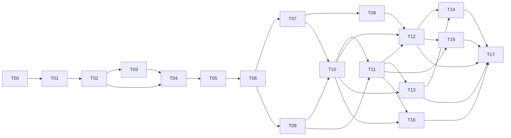

# TASKS

상태: Draft · 각 Task는 한 번에 하나씩 구현한다. Task를 마치면 "검증할 문서"와 실제 구현을 대조하고, 차이는 [conflicts.md](../conflicts.md)에 기록한 뒤 Status를 Done으로 바꾼다.

## 의존성

구현 순서: T01 → T02 → T03 → T04 → T05 → T06 → T07 → T09 → T08 → T10 → T11 → T12 → T13 → T14 → T15 → T16 → T17

## 요약

| ID | Goal | Dependencies | Status |
|---|---|---|---|
| T00 | SDD 문서 작성 | 없음 | Done (Human 검토 대기) |
| T01 | 저장소 골격 | T00 | Todo |
| T02 | .duo 스키마·loader와 fixture | T01 | Todo |
| T03 | GraphStore | T02 | Todo |
| T04 | 스캔과 fingerprint | T02, T03 | Todo |
| T05 | TS/JS LanguageAdapter | T04 | Todo |
| T06 | Graph builder와 일관성 검사 | T03, T05 | Todo |
| T07 | 증분 인덱싱 | T06 | Todo |
| T08 | duo init | T07 | Todo |
| T09 | Decision Lock과 proposal | T06 | Todo |
| T10 | Context Compiler | T07, T09 | Todo |
| T11 | Review 엔진 | T09, T10 | Todo |
| T12 | CLI | T08, T10, T11 | Todo |
| T13 | MCP 서버 | T10, T11 | Todo |
| T14 | duo install codex/claude | T12, T13 | Todo |
| T15 | Web UI | T11, T12 | Todo |
| T16 | Benchmark | T10, T11 | Todo |
| T17 | E2E와 문서 대조 | T12~T16 | Todo |

## 상세

### T00 SDD 문서 작성

- **Goal**: SDD 문서 작성
- **Input**: 원본 지시문, 기획서
- **Output**: docs/ 전체, ADR, TASKS.md, conflicts.md
- **Dependencies**: 없음
- **Acceptance Criteria**: 00~12 문서, ADR 001~011, conflicts.md 존재. 문서 간 용어·ID·Tool 이름 일치. Human 검토 요청
- **Files expected to change**: docs/**
- **Status**: Done (Human 검토 대기)
- **검증할 문서**: 전체

### T01 저장소 골격

- **Goal**: 저장소 골격
- **Input**: ADR-001, ADR-010
- **Output**: pnpm workspace, 10개 패키지 빈 구현, 빌드·테스트·lint, CI
- **Dependencies**: T00
- **Acceptance Criteria**: `pnpm install && pnpm build && pnpm test`가 3 OS CI에서 통과. `duo --version` 출력. engines node >=24.15. 번들러 결정을 ADR-010에 기록
- **Files expected to change**: package.json, pnpm-workspace.yaml, tsconfig.base.json, vitest.config.ts, packages/*/package.json, packages/*/src/index.ts, .github/workflows/ci.yml
- **Status**: Todo
- **검증할 문서**: 02, ADR-001, ADR-010

### T02 .duo 스키마·loader와 fixture

- **Goal**: .duo 스키마·loader와 fixture
- **Input**: 03 문서
- **Output**: core: zod 스키마, Markdown Requirement 파서, loader(오류 파일:줄), 경로 정규화, fs-guard. fixtures/auth-app 소스와 .duo, history.ts
- **Dependencies**: T01
- **Acceptance Criteria**: fixture .duo 전체 로드 성공. 잘못된 파일 10종이 정확한 파일:줄 오류. fs-guard가 허용 경로 밖 쓰기를 거부. Windows 경로 정규화 테스트
- **Files expected to change**: packages/core/**, fixtures/auth-app/**
- **Status**: Todo
- **검증할 문서**: 03, 10

### T03 GraphStore

- **Goal**: GraphStore
- **Input**: ADR-002, 03 SQLite 스키마
- **Output**: graph: node:sqlite 구현, 스키마 생성, CRUD, 인접 조회, BFS traverse(결정적 순서), 쓰기 잠금
- **Dependencies**: T02
- **Acceptance Criteria**: 메모리·파일 DB 모두 동작. traverse가 depth/nodeLimit/edgeTypes를 지키고 순서가 결정적. 동시 쓰기 시 두 번째 프로세스는 stale 읽기
- **Files expected to change**: packages/graph/src/store/**, packages/graph/src/traverse.ts
- **Status**: Todo
- **검증할 문서**: 03, 04

### T04 스캔과 fingerprint

- **Goal**: 스캔과 fingerprint
- **Input**: 03 project.yaml index 설정, 10 제외 규칙
- **Output**: indexer: 파일 목록(.gitignore, 기본·비밀 제외, 크기·바이너리), sha256, stat, 파일별 토큰(TokenEstimator 임시 구현)
- **Dependencies**: T02, T03
- **Acceptance Criteria**: fixture 파일·제외 목록 golden 일치. 변경 없는 재실행에서 hash 계산 0회(stat 일치 시). 비밀 파일 미포함
- **Files expected to change**: packages/indexer/src/scan/**, packages/providers/src/token/**
- **Status**: Todo
- **검증할 문서**: 03, 09, 10

### T05 TS/JS LanguageAdapter

- **Goal**: TS/JS LanguageAdapter
- **Input**: ADR-003
- **Output**: Symbol(function, class, method, exported variable), import, call reference, 테스트(describe/it/test) 추출
- **Dependencies**: T04
- **Acceptance Criteria**: grammar ABI 호환 테스트 통과. fixture Symbol·import·call·test golden 일치. parse 오류 파일은 File Node만 생성
- **Files expected to change**: packages/indexer/src/language/typescript/**, packages/indexer/grammars/*.wasm
- **Status**: Todo
- **검증할 문서**: 04, ADR-003

### T06 Graph builder와 일관성 검사

- **Goal**: Graph builder와 일관성 검사
- **Input**: T02 loader, T05 추출 결과, Git log
- **Output**: Node 8종·Edge 9종 생성(provenance 포함), CHANGED_WITH, `graph.check()`
- **Dependencies**: T03, T05
- **Acceptance Criteria**: fixture Graph의 Node/Edge golden 일치. 불변식 1~4 통과. Edge 방향이 04 표와 일치
- **Files expected to change**: packages/graph/src/build/**, packages/graph/src/check.ts, packages/providers/src/git/**
- **Status**: Todo
- **검증할 문서**: 04

### T07 증분 인덱싱

- **Goal**: 증분 인덱싱
- **Input**: 04 증분 갱신
- **Output**: 변경 탐지, owner_file 단위 교체, unresolved_refs 재연결, .duo 파일 변경 반영
- **Dependencies**: T06
- **Acceptance Criteria**: 변경 시퀀스 fuzz에서 증분 == 전체 재구축(불변식 5). 무변경 재실행 parse 0회. rename·삭제 처리
- **Files expected to change**: packages/graph/src/incremental/**
- **Status**: Todo
- **검증할 문서**: 02 Freshness, 04

### T08 duo init

- **Goal**: duo init
- **Input**: 02 init 흐름, 07 init 대화
- **Output**: init 파이프라인, 초안(vision, constraints, project.yaml), inferred.json, gaps.json, .duo/.gitignore, 대화형·비대화형
- **Dependencies**: T07
- **Acceptance Criteria**: fixture(.duo 제거본)에서 init 결과 golden 일치. llm_calls 0. 기존 .duo가 있으면 거부, --reindex는 Human 파일 불변. 비TTY에서 ASK 목록 출력. UNKNOWN 줄 → gap
- **Files expected to change**: packages/cli/src/commands/init.ts, packages/core/src/init/**
- **Status**: Todo
- **검증할 문서**: 02, 03, 07

### T09 Decision Lock과 proposal

- **Goal**: Decision Lock과 proposal
- **Input**: 03 Decision Lock
- **Output**: HEAD 기준 lock 판정 함수, 상태 전이 검사, proposal 파일 생성
- **Dependencies**: T06
- **Acceptance Criteria**: R-LOCK 시나리오 3종(BLOCK/ASK/WARN) 통과. proposal은 새 파일만 생성. 코드에서 `state: confirmed` 기록 경로 없음을 테스트로 확인
- **Files expected to change**: packages/review/src/lock/**, packages/core/src/proposals.ts
- **Status**: Todo
- **검증할 문서**: 03, ADR-007

### T10 Context Compiler

- **Goal**: Context Compiler
- **Input**: 05, 09, ADR-005
- **Output**: Seed 해석, 확장, 필수 항목, L1~L3, packing, text/json 출력, metrics.jsonl, TokenEstimator 확정
- **Dependencies**: T07, T09
- **Acceptance Criteria**: fixture 시나리오 Coverage 100%. property test로 budget 초과 0건. 결정성(같은 입력 byte 동일). 관련 gap만 ASK. 비밀 패턴 치환
- **Files expected to change**: packages/compiler/**, packages/providers/src/token/**
- **Status**: Todo
- **검증할 문서**: 05, 09

### T11 Review 엔진

- **Goal**: Review 엔진
- **Input**: ADR-007, 03 evidence
- **Output**: diff 수집, 변경 Symbol, 규칙 7종, 집계, evidence 저장, 구조적 Drift
- **Dependencies**: T09, T10
- **Acceptance Criteria**: 변경 세트 5종의 기대 verdict와 규칙 ID 일치. 모든 Claim Evidence ≥ 1. heuristic 단독 BLOCK 없음. llm_calls 0
- **Files expected to change**: packages/review/**
- **Status**: Todo
- **검증할 문서**: ADR-007, 08 Drift

### T12 CLI

- **Goal**: CLI
- **Input**: 07
- **Output**: 명령 10종, 공통 옵션, text/json 출력, 종료 코드
- **Dependencies**: T08, T10, T11
- **Acceptance Criteria**: 명령별 스모크 테스트와 종료 코드 테스트. --json 출력이 MCP structured 스키마와 같음
- **Files expected to change**: packages/cli/src/**
- **Status**: Todo
- **검증할 문서**: 07

### T13 MCP 서버

- **Goal**: MCP 서버
- **Input**: 06, ADR-004
- **Output**: Tool 9종, freshness, 오류 코드, stdio 서버(`duo mcp`)
- **Dependencies**: T10, T11
- **Acceptance Criteria**: 계약 테스트(tools/list 스냅샷, 입력 검증, 출력 스키마) 통과. stdout 순수성 테스트 통과
- **Files expected to change**: packages/mcp/**, packages/cli/src/commands/mcp.ts
- **Status**: Todo
- **검증할 문서**: 06

### T14 duo install codex/claude

- **Goal**: duo install codex|claude
- **Input**: ADR-011
- **Output**: AgentAdapter 2종, dry-run, 백업, idempotent, uninstall
- **Dependencies**: T12, T13
- **Acceptance Criteria**: 착수 시 공식 문서로 설정 형식 확인 후 ADR-011 갱신. 임시 환경에서 install → 재실행 동일 → uninstall 복원
- **Files expected to change**: packages/adapters/**, packages/cli/src/commands/install.ts
- **Status**: Todo
- **검증할 문서**: ADR-011, 10

### T15 Web UI

- **Goal**: Web UI
- **Input**: 08, ADR-009
- **Output**: HTTP 서버(API 6종, Host 검사), React 5개 화면
- **Dependencies**: T11, T12
- **Acceptance Criteria**: API 스키마 테스트. Host 헤더 위조 거부. 5개 화면이 fixture 데이터로 렌더링(컴포넌트 테스트). Graph 300 Node 상한
- **Files expected to change**: packages/ui/**, packages/cli/src/server/**
- **Status**: Todo
- **검증할 문서**: 08, 10

### T16 Benchmark

- **Goal**: Benchmark
- **Input**: 09 Benchmark
- **Output**: bench runner, 시나리오, 결과 md/json, 공개 repo 1~2개 pin
- **Dependencies**: T10, T11
- **Acceptance Criteria**: `pnpm bench` 두 번 실행 결과 동일. 09의 모든 열 포함. 결과 파일 커밋
- **Files expected to change**: bench/**
- **Status**: Todo
- **검증할 문서**: 09

### T17 E2E와 문서 대조

- **Goal**: E2E와 문서 대조
- **Input**: 11 E2E 시나리오
- **Output**: E2E 테스트, 문서-구현 차이 목록
- **Dependencies**: T12~T16
- **Acceptance Criteria**: 11의 E2E 6단계가 3 OS CI 통과. 모든 문서와 구현 대조 후 차이를 conflicts.md에 기록. v0.1 태그 준비
- **Files expected to change**: tests/e2e/**, docs/**
- **Status**: Todo
- **검증할 문서**: 전체
