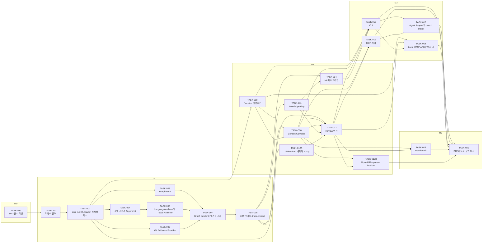

# TASKS

상태: **Frozen** (T00 final, 2026-09-27). Task는 구현 중 필요가 발견될 때만 추가하거나 나눈다.

## 규칙

- Task는 한 번에 하나씩 구현하고, 끝나면 "검증 대상 Requirement"의 문서와 실제 구현을 대조한다. 차이는 [conflicts.md](../conflicts.md)에 기록한 뒤 status를 `done`으로 바꾼다.
- 각 Task의 `duo` block은 DUO가 Issue Node로 읽는 정규 데이터다([03](../03-data-model.md#markdown-정의-형식)). Acceptance Criteria는 `**AC-NNN-NN**`로 시작하는 목록 항목이다(나뉜 Task는 `AC-012A-01`처럼 접미사를 포함).
- status: `todo` · `in_progress` · `review`(Human 검토 대기) · `done`

## 병렬 개발 Lane

6개 패키지가 곧 6개 Lane이다. 같은 단계 안에서 의존성이 없는 Task는 동시에 진행할 수 있다.

| Lane | Task |
|---|---|
| core | TASK-002, TASK-009 |
| analyzer | TASK-004, TASK-005, TASK-006 |
| graph | TASK-003, TASK-007, TASK-008 |
| director | TASK-010, TASK-011, TASK-012A, TASK-012B, TASK-013, TASK-014 |
| integration | TASK-016, TASK-017 |
| ui | TASK-018 |
| 공통(repo, apps/cli, bench, E2E) | TASK-001, TASK-015, TASK-019, TASK-020 |

## 의존성



구현 순서(위상 정렬): TASK-000 → TASK-001 → TASK-002 → TASK-003 → TASK-004 → TASK-006 → TASK-009 → TASK-012A → TASK-005 → TASK-007 → TASK-008 → TASK-010 → TASK-011 → TASK-013 → TASK-014 → TASK-012B → TASK-015 → TASK-016 → TASK-019 → TASK-017 → TASK-018 → TASK-020

병렬 가능 단계(선행 Task 완료 기준):

1. TASK-000
2. TASK-001
3. TASK-002
4. TASK-003, TASK-004, TASK-006, TASK-009, TASK-012A
5. TASK-005
6. TASK-007
7. TASK-008
8. TASK-010, TASK-011
9. TASK-013, TASK-014
10. TASK-012B, TASK-015, TASK-016, TASK-019
11. TASK-017, TASK-018
12. TASK-020

TASK-012B(OpenAI Responses Provider)는 Context Compiler(TASK-010)와 Review(TASK-013)의 입출력 계약이 안정된 뒤에 구현한다. 그 전까지 Review는 TASK-012A의 NoneProvider로 동작한다(H-15).

## MVP End-to-End 흐름과 Task

| 흐름 단계 | 담당 Task |
|---|---|
| Repository | TASK-002(fixture, self fixture) |
| DUO 설치 | TASK-001(패키지), TASK-017(`duoctl install codex/claude`) |
| `duoctl init` | TASK-014(InitService), TASK-015(명령) |
| 자동 프로젝트 분석 | TASK-004(스캔), TASK-005(AST), TASK-006(Git) |
| 필요한 Human Intent 확인 | TASK-014(질문 생성), TASK-015(대화형 입력) |
| .duo-project 생성 | TASK-002(스키마, 쓰기 guard), TASK-014 |
| Project Graph 생성 | TASK-003, TASK-007, TASK-008 |
| Agent가 MCP로 Context 요청 | TASK-016(Gateway), TASK-010(Compiler), TASK-011(Gap), TASK-017(설정) |
| 코딩 | Coding Agent(DUO 범위 밖) |
| Git Diff | TASK-006, TASK-008(변경 Symbol) |
| Duo Review | TASK-013, TASK-012A(LLM 계약, no-op), TASK-012B(의미 판정 Provider), TASK-009(Lock) |
| PASS / WARN / BLOCK / ASK | TASK-013, TASK-015/016(출력) |
| UI에서 Evidence와 Drift 확인, Decision Confirm/Reject | TASK-018, TASK-009 |
| 전체 검증 | TASK-020 |

## 요약

| ID | Title | Lane | Milestone | Dependencies | Status |
|---|---|---|---|---|---|
| [TASK-000](#task-000-sdd-문서-작성) | SDD 문서 작성 | - | M0 | - | done |
| [TASK-001](#task-001-저장소-골격) | 저장소 골격 | 공통 | M1 | TASK-000 | done |
| [TASK-002](#task-002-core-스키마-loader-추적성-파서) | core 스키마, loader, 추적성 파서 | core | M1 | TASK-001 | done |
| [TASK-003](#task-003-graphstore) | GraphStore | graph | M1 | TASK-002 | done |
| [TASK-004](#task-004-파일-스캔과-fingerprint) | 파일 스캔과 fingerprint | analyzer | M1 | TASK-002 | done |
| [TASK-005](#task-005-languageanalyzer와-tsjs-analyzer) | LanguageAnalyzer와 TS/JS Analyzer | analyzer | M1 | TASK-004 | done |
| [TASK-006](#task-006-git-evidence-provider) | Git Evidence Provider | analyzer | M1 | TASK-002 | done |
| [TASK-007](#task-007-graph-builder와-일관성-검사) | Graph builder와 일관성 검사 | graph | M1 | TASK-003, TASK-005, TASK-006 | done |
| [TASK-008](#task-008-증분-인덱싱-trace-impact) | 증분 인덱싱, trace, impact | graph | M1 | TASK-007 | done |
| [TASK-009](#task-009-decision-생명주기) | Decision 생명주기 | core | M2 | TASK-002 | done |
| [TASK-010](#task-010-context-compiler) | Context Compiler | director | M2 | TASK-008, TASK-009 | todo |
| [TASK-011](#task-011-knowledge-gap) | Knowledge Gap | director | M2 | TASK-008 | todo |
| [TASK-012A](#task-012a-llmprovider-계약과-no-op) | LLMProvider 계약과 no-op | director | M2 | TASK-002 | todo |
| [TASK-012B](#task-012b-openai-responses-provider) | OpenAI Responses Provider | director | M2 | TASK-010, TASK-013 | todo |
| [TASK-013](#task-013-review-엔진) | Review 엔진 | director | M2 | TASK-008, TASK-009, TASK-010, TASK-011, TASK-012A | todo |
| [TASK-014](#task-014-init-파이프라인) | init 파이프라인 | director | M2 | TASK-008, TASK-011 | todo |
| [TASK-015](#task-015-cli) | CLI | apps/cli | M3 | TASK-009, TASK-010, TASK-013, TASK-014 | todo |
| [TASK-016](#task-016-mcp-서버) | MCP 서버 | integration | M3 | TASK-010, TASK-013 | todo |
| [TASK-017](#task-017-agent-adapter와-duoctl-install) | Agent Adapter와 duoctl install | integration | M3 | TASK-015, TASK-016 | todo |
| [TASK-018](#task-018-local-http-api와-web-ui) | Local HTTP API와 Web UI | ui | M3 | TASK-009, TASK-013, TASK-015 | todo |
| [TASK-019](#task-019-benchmark) | Benchmark | bench | M4 | TASK-010, TASK-013 | todo |
| [TASK-020](#task-020-e2e와-문서-구현-대조) | E2E와 문서-구현 대조 | 공통 | M4 | TASK-015, TASK-016, TASK-017, TASK-018, TASK-019, TASK-012B | todo |

## 상세

### TASK-000 SDD 문서 작성

```duo
type: issue
status: done
milestone: M0
package: docs
requirements: [REQ-TRACE-001]
decisions: [ADR-014]
depends_on: []
```

- **Goal**: MVP 설계를 docs/에 확정한다.
- **Input**: 개발 지시문, 기획서, Human 결정 H-1~H-11
- **Output**: docs/ 13개 문서, conflicts.md, ADR 14개, TASKS.md
- **Dependencies**: 없음
- **Files expected to change**: `docs/**`
- **Status**: done
- **검증 대상 Requirement**: [REQ-TRACE-001](../01-requirements.md#req-trace-001-id-기반-추적성)
- **관련 ADR**: [ADR-014](../adr/ADR-014-traceability-ids.md)

Acceptance Criteria

- **AC-000-01** 00~12 문서, conflicts.md, adr/, tasks/TASKS.md가 존재한다
- **AC-000-02** 모든 REQ/ADR/TASK ID가 유일하고 모든 참조가 존재하는 ID를 가리킨다
- **AC-000-03** MVP Requirement마다 최소 하나의 Task가 있다
- **AC-000-04** Human 검토를 요청한다

### TASK-001 저장소 골격

```duo
type: issue
status: done
milestone: M1
package: repo
requirements: [REQ-NFR-001, REQ-NFR-003, REQ-CLI-001]
decisions: [ADR-001, ADR-010]
depends_on: [TASK-000]
```

- **Goal**: 6개 패키지와 apps/cli의 빈 골격, 빌드, 테스트, CI를 만든다.
- **Input**: ADR-001, ADR-010
- **Output**: pnpm workspace, 패키지 빈 구현, lint/test/build, 3 OS CI
- **Dependencies**: [TASK-000](#task-000-sdd-문서-작성)
- **Files expected to change**: `package.json`, `pnpm-workspace.yaml`, `tsconfig.base.json`, `vitest.config.ts`, `packages/*/package.json`, `apps/cli/package.json`, `.github/workflows/ci.yml`
- **Status**: done
- **검증 대상 Requirement**: [REQ-NFR-001](../01-requirements.md#req-nfr-001-cross-platform), [REQ-NFR-003](../01-requirements.md#req-nfr-003-네이티브-빌드-없는-설치), [REQ-CLI-001](../01-requirements.md#req-cli-001-얇은-cli)
- **관련 ADR**: [ADR-001](../adr/ADR-001-language-runtime.md), [ADR-010](../adr/ADR-010-package-structure.md)

Acceptance Criteria

- **AC-001-01** `pnpm install && pnpm build && pnpm test`가 ubuntu/windows/macos CI에서 통과한다
- **AC-001-02** 패키지 의존 방향(02 문서) 위반 import가 lint에서 실패한다
- **AC-001-03** `duoctl --version`이 동작하고 apps/cli에는 domain 코드가 없다
- **AC-001-04** engines가 node >=24.15이고 네이티브 빌드 의존성이 없다

### TASK-002 core 스키마, loader, 추적성 파서

```duo
type: issue
status: done
milestone: M1
package: core
requirements: [REQ-TRUTH-001, REQ-TRUTH-003, REQ-TRACE-001, REQ-SAFETY-001]
decisions: [ADR-006, ADR-014]
depends_on: [TASK-001]
```

- **Goal**: .duo-project 파일과 추적성 Markdown을 읽고 검증하는 core를 만든다.
- **Input**: 03 문서, ADR-006, ADR-014
- **Output**: zod 스키마, loader, Markdown 정의 파서, External Source provenance(path, hash), ID 검사, write boundary 정책(`checkWriteBoundary`), fixtures/auth-app
- **Dependencies**: [TASK-001](#task-001-저장소-골격)
- **Files expected to change**: `packages/core/src/schema/**`, `packages/core/src/loader/**`, `packages/core/src/trace/**`, `packages/core/src/write-boundary.ts`, `fixtures/auth-app/**`
- **Status**: done (T02.1, AC-002-04 충족)
- **검증 대상 Requirement**: [REQ-TRUTH-001](../01-requirements.md#req-truth-001-duo-project-project-truth-layer와-소유권), [REQ-TRUTH-003](../01-requirements.md#req-truth-003-human-readable-형식과-스키마-검증), [REQ-TRACE-001](../01-requirements.md#req-trace-001-id-기반-추적성), [REQ-SAFETY-001](../01-requirements.md#req-safety-001-source-code-비수정과-쓰기-경로-제한)
- **관련 ADR**: [ADR-006](../adr/ADR-006-duo-layout-git-policy.md), [ADR-014](../adr/ADR-014-traceability-ids.md)

Acceptance Criteria

- **AC-002-01** fixtures/auth-app/.duo-project 전체가 오류 없이 로드된다
- **AC-002-02** 잘못된 파일 10종이 파일:줄을 포함한 오류를 낸다
- **AC-002-03** 이 저장소 docs/의 정의 파일을 임시 저장소의 .duo-project/로 복사해 로드하면 REQ/ADR/TASK/Milestone이 모두 파싱되고 참조가 전부 해석된다(self fixture)
- **AC-002-04** fs-guard가 허용 경로 밖 쓰기를 거부한다(구현: 순수 정책 `checkWriteBoundary`, T02.1)
- **AC-002-05** Windows 경로가 POSIX 상대경로로 정규화된다

### TASK-003 GraphStore

```duo
type: issue
status: done
milestone: M1
package: graph
requirements: [REQ-GRAPH-001, REQ-GRAPH-002]
decisions: [ADR-002]
depends_on: [TASK-002]
```

- **Goal**: Node/Edge 저장과 bounded traversal을 제공한다.
- **Input**: 03 SQLite 스키마, 04 탐색 규칙
- **Output**: GraphStore 인터페이스, NodeSqliteGraphStore, graph_schema_version, 인접 조회, BFS, 쓰기 잠금
- **Dependencies**: [TASK-002](#task-002-core-스키마-loader-추적성-파서)
- **Files expected to change**: `packages/graph/src/store/**`, `packages/graph/src/store/node-sqlite/**`, `packages/graph/src/traverse.ts`
- **Status**: done (T03; AC-003-03 문구는 conflicts.md C31로 정정)
- **검증 대상 Requirement**: [REQ-GRAPH-001](../01-requirements.md#req-graph-001-node-8종과-edge-10종의-embedded-저장), [REQ-GRAPH-002](../01-requirements.md#req-graph-002-결정적-bounded-traversal-trace-impact)
- **관련 ADR**: [ADR-002](../adr/ADR-002-graph-storage.md)

Acceptance Criteria

- **AC-003-01** 메모리와 파일 DB에서 같은 테스트가 통과한다
- **AC-003-02** traverse가 maxDepth, nodeLimit, edgeTypes를 지키고 방문 순서가 결정적이다
- **AC-003-03** 쓰기 잠금을 얻지 못한 두 번째 프로세스는 `busy` 결과를 받고 마지막 commit 상태를 읽는다(snapshot visibility). GraphStore는 `contentHash`와 `source`를 손실 없이 저장만 하고 freshness(stale)를 판정하지 않는다. 판정은 TASK-004의 비교 primitive와 TASK-008 Indexer가 한다(C31)
- **AC-003-04** node:sqlite import는 NodeSqliteGraphStore 안에만 있고 GraphStore 인터페이스에 SQL이나 storage 전용 타입이 노출되지 않는다. graph_schema_version이 다르면 재생성한다

### TASK-004 파일 스캔과 fingerprint

```duo
type: issue
status: done
milestone: M1
package: analyzer
requirements: [REQ-INDEX-002, REQ-SAFETY-001, REQ-NFR-001]
decisions: [ADR-002]
depends_on: [TASK-002]
```

- **Goal**: 인덱싱 대상 파일을 찾고, OS와 checkout EOL에 관계없는 content fingerprint와 파일 단위 변경 비교를 제공한다. 토큰 측정은 TASK-010으로 옮겼다(H-21).
- **Input**: 03 project.yaml index 설정과 [Repository scan](../03-data-model.md#repository-scan과-fingerprint) 절, 10 제외 규칙
- **Output**: `scanRepository`(Git index/untracked 기준, symlink 비추적), 확장자 기반 fingerprint mode(`normalized-text` / `raw`), `contentHash`, 파일 타입 변경 사실(`FILE_TYPE_CHANGED`), `generated/fingerprints.json`, `compareFingerprints`(UNCHANGED/CHANGED/ADDED/DELETED), 공통 정렬 `compareUtf8`
- **Dependencies**: [TASK-002](#task-002-core-스키마-loader-추적성-파서)
- **Files expected to change**: `packages/analyzer/src/scan/**`, `packages/analyzer/src/fingerprint/**`. 정렬 통일(H-21)로 `packages/core/src/order.ts`, `packages/core/src/paths.ts`(glob), `packages/graph/src/traverse.ts`, `packages/graph/src/store/json.ts`
- **Status**: done (T04)
- **검증 대상 Requirement**: [REQ-INDEX-002](../01-requirements.md#req-index-002-fingerprint-기반-증분-인덱싱), [REQ-SAFETY-001](../01-requirements.md#req-safety-001-source-code-비수정과-쓰기-경로-제한), [REQ-NFR-001](../01-requirements.md#req-nfr-001-cross-platform)
- **관련 ADR**: [ADR-002](../adr/ADR-002-graph-storage.md)

Acceptance Criteria

- **AC-004-01** fixture의 포함/제외 파일 목록과 fingerprint가 golden과 같다(3개 OS에서 같은 golden)
- **AC-004-02** 비밀 파일 패턴, .gitignore 대상, `.git/`, DUO regenerable 영역, symlink가 제외되고 symlink 대상은 읽지 않는다
- **AC-004-03** 변경 판정은 `contentHash`로 한다. mtime만 바뀐 파일은 UNCHANGED, 크기가 같아도 내용이 바뀐 파일은 CHANGED다(C33)
- **AC-004-04** `normalized-text` 모드는 CRLF → LF만 정규화한 SHA-256, `raw` 모드는 원본 bytes의 SHA-256이다. BOM, Unicode 정규화, 공백, lone CR은 보존된다(C34, C37)

### TASK-005 LanguageAnalyzer와 TS/JS Analyzer

```duo
type: issue
status: done
milestone: M1
package: analyzer
requirements: [REQ-INDEX-001]
decisions: [ADR-003]
depends_on: [TASK-004]
```

- **Goal**: 언어 비종속 인터페이스와 TypeScript/JavaScript 구현으로 syntax 사실(Symbol, module reference, call site, DUO annotation, parse diagnostic)을 추출한다. Graph와 resolution은 하지 않는다.
- **Input**: ADR-003, 04 SourceAnalysis
- **Output**: LanguageAnalyzer, AnalyzerRegistry, TypeScriptAnalyzer, JavaScriptAnalyzer, grammar smoke test, core `sliceSourceLocation`/`compareSourceLocations`
- **Dependencies**: [TASK-004](#task-004-파일-스캔과-fingerprint)
- **Files expected to change**: `packages/analyzer/src/language/**`. grammar WASM은 공식 패키지 파일을 쓰므로 `packages/analyzer/grammars/`는 없다(C38)
- **Status**: done (T05)
- **검증 대상 Requirement**: [REQ-INDEX-001](../01-requirements.md#req-index-001-언어-비종속-languageanalyzer)
- **관련 ADR**: [ADR-003](../adr/ADR-003-language-analysis.md)

Acceptance Criteria

- **AC-005-01** grammar wasm과 web-tree-sitter ABI 호환 테스트가 먼저 통과한다(CI `pnpm test:grammars`, 3개 OS)
- **AC-005-02** fixture의 Symbol, module reference(import binding, re-export), call site, DUO annotation, test 정의 추출 결과가 기대값·golden과 같다(3개 OS, T05.1에서 test와 binding 추가, C40)
- **AC-005-03** parse 오류 파일은 `parseStatus: "partial"`과 `AST_PARSE_ERROR`를 내고 ERROR 노드 밖의 사실은 계속 추출한다(C39)
- **AC-005-04** Analyzer 등록부에 새 언어를 추가하는 데 다른 패키지 수정이 필요 없다(테스트용 더미 Analyzer로 검증)

### TASK-006 Git Evidence Provider

```duo
type: issue
status: done
milestone: M1
package: analyzer
requirements: [REQ-INDEX-003, REQ-PROVIDER-001]
decisions: []
depends_on: [TASK-002]
```

- **Goal**: Git 상태와 Evidence provenance(HEAD / Index / Working Tree, 변경, diff, HEAD 내용, co-change 후보, Issue 키 후보)를 LLM 없이 read-only로 제공한다. Graph 갱신과 freshness 판정은 하지 않는다.
- **Input**: 02 EvidenceProvider, 04 CHANGED_WITH 규칙
- **Output**: `GitProvider`(`openGitProvider`: repositoryState, listWorkingTreeChanges, listChanges, getDiff, blobProvenance, readBlob, listCommits), `computeCoChangeCandidates`, `extractIssueKeys`. core `EvidenceProvider` 인터페이스 연결은 TASK-013(C44)
- **Dependencies**: [TASK-002](#task-002-core-스키마-loader-추적성-파서)
- **Files expected to change**: `packages/analyzer/src/git/**`(Scanner의 Git 실행도 `git/exec.ts`로 옮김)
- **Status**: done (T06)
- **검증 대상 Requirement**: [REQ-INDEX-003](../01-requirements.md#req-index-003-git-diff에서-변경-symbol-도출), [REQ-PROVIDER-001](../01-requirements.md#req-provider-001-evidenceprovider와-git-provider)
- **관련 ADR**: 없음

Acceptance Criteria

- **AC-006-01** working tree, staged, base..HEAD diff의 파일 목록과 hunk 줄 범위가 정확하다
- **AC-006-02** HEAD 시점 파일 내용을 읽을 수 있다(Decision Lock 기준선)
- **AC-006-03** CHANGED_WITH 후보가 04 규칙(최근 500 커밋, 3회 이상, 50파일 초과 커밋 제외)대로 계산된다
- **AC-006-04** 커밋 메시지와 브랜치 이름에서 Issue 키를 추출한다

### TASK-007 Graph builder와 일관성 검사

```duo
type: issue
status: done
milestone: M1
package: graph
requirements: [REQ-GRAPH-001, REQ-GRAPH-003, REQ-TRACE-001]
decisions: [ADR-002, ADR-014]
depends_on: [TASK-003, TASK-005, TASK-006]
```

- **Goal**: core, analyzer 결과로 Project Graph를 만든다. Evidence로 설명할 수 있는 관계만 저장한다(H-24).
- **Input**: 04 Node/Edge 표
- **Output**: `collectGraphFacts` → `buildGraphPlan`(payload schema, endpoint matrix, `ModuleResolver` / `TypeScriptModuleResolver`, ExportIndex, exact CALLS, annotation attachment, Test/VALIDATED_BY, CHANGED_WITH, stats) → `applyGraphPlan`(transaction 하나), `checkGraph`(불변식 1~4, 6, 7)
- **Dependencies**: [TASK-003](#task-003-graphstore), [TASK-005](#task-005-languageanalyzer와-tsjs-analyzer), [TASK-006](#task-006-git-evidence-provider)
- **Files expected to change**: `packages/graph/src/build/**`, `packages/graph/src/check.ts`, Analyzer v3 사실(`packages/analyzer/src/language/**`, C51), `packages/core/src/diagnostics.ts`, `scripts/boundaries.json`·`eslint.config.js`(`typescriptApi` 경계), `fixtures/graph/**`
- **Status**: done (T07)
- **검증 대상 Requirement**: [REQ-GRAPH-001](../01-requirements.md#req-graph-001-node-8종과-edge-10종의-embedded-저장), [REQ-GRAPH-003](../01-requirements.md#req-graph-003-graph-일관성-불변식), [REQ-TRACE-001](../01-requirements.md#req-trace-001-id-기반-추적성)
- **관련 ADR**: [ADR-002](../adr/ADR-002-graph-storage.md), [ADR-014](../adr/ADR-014-traceability-ids.md)

Acceptance Criteria

- **AC-007-01** fixture Graph의 Node/Edge를 GraphStore에서 읽어 관계별로 직접 assertion한다(단일 golden snapshot 대신, C56)
- **AC-007-02** 불변식 1~4와 6(정의 ID 전역 유일성)이 통과한다
- **AC-007-03** self fixture로 만든 Graph에서 REQ-CONTEXT-001 → ADR-005 → TASK-010 경로가 탐색된다
- **AC-007-04** Edge 방향과 endpoint 타입이 04 표와 일치한다

### TASK-008 증분 인덱싱, trace, impact

```duo
type: issue
status: done
milestone: M1
package: graph
requirements: [REQ-INDEX-002, REQ-GRAPH-002, REQ-GRAPH-003]
decisions: [ADR-002]
depends_on: [TASK-007]
```

- **Goal**: 변경된 부분만 다시 분석·해석하고, 결과가 clean full rebuild와 같은 Graph를 유지한다(Incremental Result == Clean Full Rebuild Result). trace/impact를 제공한다.
- **Input**: 04 증분 갱신 절차
- **Output**: `indexRepository`(analysis cache, module/call resolution memo와 dependency, history window 재사용, scope digest diff, 한 transaction + state token, 전체 재구축 fallback, freshness와 metrics), graph schema 2(`owner_file`, meta), Edge `categories`, `dumpGraph`, `trace()`, `impact()`
- **Dependencies**: [TASK-007](#task-007-graph-builder와-일관성-검사)
- **Files expected to change**: `packages/graph/src/incremental/**`, `packages/graph/src/query/**`, `packages/graph/src/store/**`(schema 2), `packages/graph/src/build/**`(memo, categories, ownerFile, history, scope), `packages/graph/src/check.ts`, `packages/core/src/diagnostics.ts`
- **Status**: done (T08)
- **검증 대상 Requirement**: [REQ-INDEX-002](../01-requirements.md#req-index-002-fingerprint-기반-증분-인덱싱), [REQ-GRAPH-002](../01-requirements.md#req-graph-002-결정적-bounded-traversal-trace-impact), [REQ-GRAPH-003](../01-requirements.md#req-graph-003-graph-일관성-불변식)
- **관련 ADR**: [ADR-002](../adr/ADR-002-graph-storage.md)

Acceptance Criteria

- **AC-008-01** 임의 변경 시퀀스(fuzz)에서 증분 결과가 전체 재구축 결과와 같다(불변식 5)
- **AC-008-02** 변경 없는 재실행에서 parse 호출이 0회다
- **AC-008-03** rename과 삭제를 올바르게 반영한다
- **AC-008-04** trace와 impact 결과가 fixture golden과 같다

### TASK-009 Decision 생명주기

```duo
type: issue
status: done
milestone: M2
package: core
requirements: [REQ-DECISION-001, REQ-DECISION-002, REQ-DECISION-003]
decisions: [ADR-013]
depends_on: [TASK-002]
```

- **Goal**: proposal 생성, confirm, reject, lock digest를 구현한다. AI may propose, Human confirms.
- **Input**: ADR-013, 03 Decision 스키마
- **Output**: `createDecisionService`(propose, confirm, reject, repair, verifyLock), actor 권한 표, P-###/D-### 할당, 저장소 lock, exclusive 생성과 atomic 교체, supersede, stale 탐지, `guardDecisionWrite`, schema 확장(enforcement, proposal, proposed_by_kind, based_on)
- **Dependencies**: [TASK-002](#task-002-core-스키마-loader-추적성-파서)
- **Files expected to change**: `packages/core/src/decisions/**`, `packages/core/src/schema/schemas.ts`, `packages/core/src/domain/**`, `packages/core/src/source/yaml.ts`(YAML 쓰기·수정 helper), `packages/core/src/ids.ts`, `packages/core/src/diagnostics.ts`
- **Status**: done (T09)
- **검증 대상 Requirement**: [REQ-DECISION-001](../01-requirements.md#req-decision-001-decision-제안), [REQ-DECISION-002](../01-requirements.md#req-decision-002-human-confirmreject), [REQ-DECISION-003](../01-requirements.md#req-decision-003-decision-lock)
- **관련 ADR**: [ADR-013](../adr/ADR-013-decision-lifecycle.md)

Acceptance Criteria

- **AC-009-01** propose는 decisions/proposals/에 새 파일만 만든다
- **AC-009-02** confirm은 다음 D-### ID로 파일을 옮기고 confirmed_by, confirmed_at, lock digest를 기록한다
- **AC-009-03** supersede confirm 시 기존 Decision은 state와 superseded_by만 바뀌고 lock digest는 유효하다
- **AC-009-04** reject는 proposal에 rejected 상태와 사유를 기록한다
- **AC-009-05** confirm/reject 외에는 state: confirmed를 쓰는 코드 경로가 없다(정적 검사 테스트)

### TASK-010 Context Compiler

```duo
type: issue
status: done
milestone: M2
package: director
requirements: [REQ-CONTEXT-001, REQ-CONTEXT-002, REQ-CONTEXT-003, REQ-NFR-005, REQ-TOKEN-001]
decisions: [ADR-005, ADR-008, ADR-004]
depends_on: [TASK-008, TASK-009]
```

- **Goal**: Task에서 budget 이하의 Director Context Packet을 만든다.
- **Input**: 05 알고리즘, 09 지표
- **Output**: `compileContext`(read-only freshness, seed 해석, 가중 best-first 탐색, 후보 분류와 순위, L1~L3 표현, budget 배분, Packet Dependency Digest, opt-in Packet cache), `ContextPacket` 구조와 `renderContextMarkdown`, 비밀 치환, 요청 지표와 단계별 시간, TokenEstimator(o200k_base = gpt-tokenizer 4.0.0, chars/4는 UI 전용, H-21, ADR-005)
- **Dependencies**: [TASK-008](#task-008-증분-인덱싱-trace-impact), [TASK-009](#task-009-decision-생명주기)
- **Files expected to change**: `packages/director/src/context/**`, `packages/director/src/tokens/**`(TASKS의 core/src/tokens 대신, C79), `fixtures/context/app/**`, `packages/core/src/diagnostics.ts`, `scripts/boundaries.json`, `eslint.config.js`
- **Status**: done (T10)
- **검증 대상 Requirement**: [REQ-CONTEXT-001](../01-requirements.md#req-context-001-director-context-packet-생성), [REQ-CONTEXT-002](../01-requirements.md#req-context-002-token-budget-상한), [REQ-CONTEXT-003](../01-requirements.md#req-context-003-context-지표-기록), [REQ-NFR-005](../01-requirements.md#req-nfr-005-결정적-출력), [REQ-TOKEN-001](../01-requirements.md#req-token-001-토큰-측정-방식과-표기)
- **관련 ADR**: [ADR-005](../adr/ADR-005-token-measurement.md), [ADR-008](../adr/ADR-008-deterministic-first.md), [ADR-004](../adr/ADR-004-mcp-context-gateway.md)

Acceptance Criteria

- **AC-010-01** fixture 시나리오의 필수 Node Coverage가 100%다
- **AC-010-02** property test에서 budget 초과가 0건이다
- **AC-010-03** 같은 입력은 byte 단위로 같은 Packet을 만든다
- **AC-010-04** Context 생성 중 LLM 호출이 0회다
- **AC-010-05** 비밀 패턴이 [REDACTED]로 치환된다
- **AC-010-06** 모든 토큰 값에 estimator 이름이 붙고 bytes/chars도 함께 기록된다(TASK-004의 이전 AC-004-04를 옮김, H-21)


### TASK-011 Knowledge Gap

```duo
type: issue
status: done
milestone: M2
package: director
requirements: [REQ-GAP-001]
decisions: [ADR-008]
depends_on: [TASK-008]
```

- **Goal**: Gap을 탐지하고 Task 관련성으로 노출 여부를 정한다.
- **Input**: 03 gaps, 05 필수 항목 규칙
- **Output**: T10.1 공통 Intent relevance policy(`matchConstraint`, `matchDeclaredGap`), Markdown AST 기반 `UNKNOWN:` 추출과 `DeclaredGap`(owner, 안정 ID, key), `assessKnowledgeGaps`(Declared·Runtime Gap, ask·surface·ignore, requiresHumanInput, primary), `renderGapQuestions`
- **Dependencies**: [TASK-008](#task-008-증분-인덱싱-trace-impact)
- **Files expected to change**: `packages/director/src/gap/**`, `packages/director/src/relevance/**`, `packages/director/src/context/candidates.ts`, `packages/core/src/source/markdown.ts`, `packages/core/src/domain/**`, `packages/core/src/loader/project.ts`, `fixtures/gap/app/**`
- **Status**: done (T10.1, T11)
- **검증 대상 Requirement**: [REQ-GAP-001](../01-requirements.md#req-gap-001-knowledge-gap-기록과-관련성-기반-질문)
- **관련 ADR**: [ADR-008](../adr/ADR-008-deterministic-first.md)

Acceptance Criteria

- **AC-011-01** UNKNOWN: 줄과 구조 규칙에서 Gap이 생성되고 ID가 안정적이다
- **AC-011-02** anchor가 Subgraph에 있는 Gap만 ASK가 된다
- **AC-011-03** 무관한 Gap은 Packet에 없고 gaps_suppressed만 증가한다
- **AC-011-04** UNKNOWN: 줄을 지우면 resolved가 된다


### TASK-012A LLMProvider 계약과 no-op

```duo
type: issue
status: todo
milestone: M2
package: director
requirements: [REQ-LLM-002, REQ-LLM-003, REQ-LLM-004]
decisions: [ADR-008, ADR-012]
depends_on: [TASK-002]
```

- **Goal**: Provider에 종속되지 않는 LLMProvider 계약, NoneProvider, 응답 검증, 사용량 기록 형식을 만든다.
- **Input**: ADR-008, ADR-012
- **Output**: LLMProvider 인터페이스, NoneProvider, 응답 스키마와 Evidence 인용 검증, usage 기록
- **Dependencies**: [TASK-002](#task-002-core-스키마-loader-추적성-파서)
- **Files expected to change**: `packages/director/src/llm/contract/**`, `packages/director/src/llm/none/**`
- **Status**: todo
- **검증 대상 Requirement**: [REQ-LLM-002](../01-requirements.md#req-llm-002-llmprovider와-동작하는-provider-1종), [REQ-LLM-003](../01-requirements.md#req-llm-003-llm-없이도-동작), [REQ-LLM-004](../01-requirements.md#req-llm-004-llm-사용량-기록)
- **관련 ADR**: [ADR-008](../adr/ADR-008-deterministic-first.md), [ADR-012](../adr/ADR-012-llm-provider.md)

Acceptance Criteria

- **AC-012A-01** Provider가 꺼져 있거나 API Key가 없으면 NoneProvider가 선택되고 모든 호출이 UNAVAILABLE을 반환한다
- **AC-012A-02** 응답이 Packet에 없는 Evidence ID를 인용하거나 스키마가 맞지 않으면 결과를 버리고 UNKNOWN으로 처리한다(가짜 Provider로 검증)
- **AC-012A-03** usage(입력/출력 토큰, 출처 provider 또는 estimated)가 runtime/metrics.jsonl 형식으로 기록된다

### TASK-012B OpenAI Responses Provider

```duo
type: issue
status: todo
milestone: M2
package: director
requirements: [REQ-LLM-002, REQ-NFR-002]
decisions: [ADR-012]
depends_on: [TASK-010, TASK-013]
```

- **Goal**: 안정된 Context Compiler와 Review 계약 위에 OpenAI Responses API Adapter를 구현한다.
- **Input**: ADR-012, TASK-010과 TASK-013의 입출력 계약, OpenAI 공식 문서
- **Output**: OpenAIResponsesProvider
- **Dependencies**: [TASK-010](#task-010-context-compiler), [TASK-013](#task-013-review-엔진)
- **Files expected to change**: `packages/director/src/llm/openai-responses/**`
- **Status**: todo
- **검증 대상 Requirement**: [REQ-LLM-002](../01-requirements.md#req-llm-002-llmprovider와-동작하는-provider-1종), [REQ-NFR-002](../01-requirements.md#req-nfr-002-local-first)
- **관련 ADR**: [ADR-012](../adr/ADR-012-llm-provider.md)

Acceptance Criteria

- **AC-012B-01** 착수 시 Responses API 공식 문서를 확인해 ADR-012에 기록하고, 가짜 HTTP 서버로 요청 형식, 타임아웃, 재시도, 스키마 검증 실패 처리를 검증한다
- **AC-012B-02** API Key는 api_key_env 환경 변수에서만 읽고 파일, 로그, metrics, 오류 메시지에 쓰지 않는다

### TASK-013 Review 엔진

```duo
type: issue
status: todo
milestone: M2
package: director
requirements: [REQ-REVIEW-001, REQ-REVIEW-002, REQ-REVIEW-003, REQ-REVIEW-004, REQ-EVIDENCE-001, REQ-LLM-001, REQ-DECISION-003]
decisions: [ADR-007, ADR-008, ADR-013]
depends_on: [TASK-008, TASK-009, TASK-010, TASK-011, TASK-012A]
```

- **Goal**: 변경을 규칙과 의미 판정으로 검수하고 Verdict를 낸다.
- **Input**: ADR-007 규칙 표
- **Output**: 규칙 실행, semantic escalation, 집계, runtime evidence, Review Record, 구조적 Drift, External Source Drift
- **Dependencies**: [TASK-008](#task-008-증분-인덱싱-trace-impact), [TASK-009](#task-009-decision-생명주기), [TASK-010](#task-010-context-compiler), [TASK-011](#task-011-knowledge-gap), [TASK-012A](#task-012a-llmprovider-계약과-no-op)
- **Files expected to change**: `packages/director/src/review/**`, `packages/director/src/evidence/**`
- **Status**: todo
- **검증 대상 Requirement**: [REQ-REVIEW-001](../01-requirements.md#req-review-001-diff-review-파이프라인), [REQ-REVIEW-002](../01-requirements.md#req-review-002-두-수준-verdict-모델), [REQ-REVIEW-003](../01-requirements.md#req-review-003-scope-drift와-spec-conflict-감지), [REQ-REVIEW-004](../01-requirements.md#req-review-004-specdecisionissue와-code-사이의-drift), [REQ-EVIDENCE-001](../01-requirements.md#req-evidence-001-claim-evidence-verdict와-근거-보존), [REQ-LLM-001](../01-requirements.md#req-llm-001-deterministic-first-판단-순서), [REQ-DECISION-003](../01-requirements.md#req-decision-003-decision-lock)
- **관련 ADR**: [ADR-007](../adr/ADR-007-verdict-model.md), [ADR-008](../adr/ADR-008-deterministic-first.md), [ADR-013](../adr/ADR-013-decision-lifecycle.md)

Acceptance Criteria

- **AC-013-01** 변경 세트 7종의 Verdict와 규칙 ID가 기대값과 같다
- **AC-013-02** 모든 Claim이 Evidence를 1개 이상 가진다
- **AC-013-03** LLM 없이 실행하면 의미 판단 Claim은 UNKNOWN이고 skipped_checks에 기록된다
- **AC-013-04** LLM이나 heuristic 근거만으로는 BLOCK이 나오지 않는다
- **AC-013-05** --record는 .duo-project/reviews/에 코드 본문 없이 Evidence Pointer(commit SHA, 경로, Symbol, 줄 범위, content hash, ID)만 저장한다

### TASK-014 init 파이프라인

```duo
type: issue
status: todo
milestone: M2
package: director
requirements: [REQ-INIT-001, REQ-INIT-002, REQ-INIT-003, REQ-TRUTH-001, REQ-TRUTH-002]
decisions: [ADR-006, ADR-008]
depends_on: [TASK-008, TASK-011]
```

- **Goal**: 최초 분석, 초안, Human 확인 질문을 만든다.
- **Input**: 02 init 흐름, 07 init 대화
- **Output**: InitService(analyze, draft, questions, write)
- **Dependencies**: [TASK-008](#task-008-증분-인덱싱-trace-impact), [TASK-011](#task-011-knowledge-gap)
- **Files expected to change**: `packages/director/src/init/**`
- **Status**: todo
- **검증 대상 Requirement**: [REQ-INIT-001](../01-requirements.md#req-init-001-결정적-repository-분석), [REQ-INIT-002](../01-requirements.md#req-init-002-intent-초안-구현-상태-추론-knowledge-gap-생성), [REQ-INIT-003](../01-requirements.md#req-init-003-human-intent-확인), [REQ-TRUTH-001](../01-requirements.md#req-truth-001-duo-project-project-truth-layer와-소유권), [REQ-TRUTH-002](../01-requirements.md#req-truth-002-git-관리-정책)
- **관련 ADR**: [ADR-006](../adr/ADR-006-duo-layout-git-policy.md), [ADR-008](../adr/ADR-008-deterministic-first.md)

Acceptance Criteria

- **AC-014-01** fixture(.duo-project 제거본)에서 init 결과가 golden과 같다
- **AC-014-02** init 중 LLM 호출이 0회다
- **AC-014-03** 기존 .duo-project가 있으면 거부한다. --reindex는 Human-owned 파일을 바꾸지 않고, generated/를 지운 뒤 실행하면 같은 Graph를 만든다
- **AC-014-04** 비대화형 실행은 질문을 ASK 목록으로 반환하고 초안에 UNKNOWN: 줄로 남긴다
- **AC-014-05** .duo-project/.gitignore가 ADR-006 정책대로 생성된다

### TASK-015 CLI

```duo
type: issue
status: todo
milestone: M3
package: cli
requirements: [REQ-CLI-001, REQ-DECISION-002, REQ-NFR-006]
decisions: [ADR-010, ADR-013]
depends_on: [TASK-009, TASK-010, TASK-013, TASK-014]
```

- **Goal**: 명령을 packages의 서비스에 연결한다.
- **Input**: 07 명령 표
- **Output**: apps/cli 명령, 대화형 입력, 출력 형식, 종료 코드
- **Dependencies**: [TASK-009](#task-009-decision-생명주기), [TASK-010](#task-010-context-compiler), [TASK-013](#task-013-review-엔진), [TASK-014](#task-014-init-파이프라인)
- **Files expected to change**: `apps/cli/src/**`
- **Status**: todo
- **검증 대상 Requirement**: [REQ-CLI-001](../01-requirements.md#req-cli-001-얇은-cli), [REQ-DECISION-002](../01-requirements.md#req-decision-002-human-confirmreject), [REQ-NFR-006](../01-requirements.md#req-nfr-006-간결한-기본-출력)
- **관련 ADR**: [ADR-010](../adr/ADR-010-package-structure.md), [ADR-013](../adr/ADR-013-decision-lifecycle.md)

Acceptance Criteria

- **AC-015-01** 07의 모든 명령이 스모크 테스트를 통과한다
- **AC-015-02** 종료 코드가 07 표와 같다
- **AC-015-03** --json 출력이 MCP structuredContent 스키마와 같다
- **AC-015-04** `duoctl decision confirm`은 TTY가 아니면 거부한다
- **AC-015-05** apps/cli에 domain 로직이 없다(의존 방향 lint)

### TASK-016 MCP 서버

```duo
type: issue
status: todo
milestone: M3
package: integration
requirements: [REQ-MCP-001, REQ-NFR-007]
decisions: [ADR-004]
depends_on: [TASK-010, TASK-013]
```

- **Goal**: Context Gateway MCP 서버를 만든다.
- **Input**: 06 Tool 계약, ADR-004
- **Output**: Tool 9종, freshness, 오류 코드, `duoctl mcp`
- **Dependencies**: [TASK-010](#task-010-context-compiler), [TASK-013](#task-013-review-엔진)
- **Files expected to change**: `packages/integration/src/mcp/**`
- **Status**: todo
- **검증 대상 Requirement**: [REQ-MCP-001](../01-requirements.md#req-mcp-001-mcp-context-gateway), [REQ-NFR-007](../01-requirements.md#req-nfr-007-mcp-stdout-순수성)
- **관련 ADR**: [ADR-004](../adr/ADR-004-mcp-context-gateway.md)

Acceptance Criteria

- **AC-016-01** 착수 시 MCP SDK v2 공식 문서를 다시 확인하고 ADR-004에 버전을 기록한다
- **AC-016-02** tools/list 스냅샷이 06의 9개 Tool과 같다
- **AC-016-03** 각 Tool의 입력 검증 오류와 structured 출력 스키마가 계약과 같다
- **AC-016-04** stdout에 JSON-RPC 외 바이트가 없다
- **AC-016-05** confirm/reject Tool이 존재하지 않는다

### TASK-017 Agent Adapter와 duoctl install

```duo
type: issue
status: todo
milestone: M3
package: integration
requirements: [REQ-AGENT-001]
decisions: [ADR-011]
depends_on: [TASK-015, TASK-016]
```

- **Goal**: Codex와 Claude Code 연동을 설치한다.
- **Input**: ADR-011
- **Output**: AgentAdapter(codex, claude), dry-run, 백업, uninstall
- **Dependencies**: [TASK-015](#task-015-cli), [TASK-016](#task-016-mcp-서버)
- **Files expected to change**: `packages/integration/src/agents/**`
- **Status**: todo
- **검증 대상 Requirement**: [REQ-AGENT-001](../01-requirements.md#req-agent-001-duoctl-install-codexclaude)
- **관련 ADR**: [ADR-011](../adr/ADR-011-agent-integration.md)

Acceptance Criteria

- **AC-017-01** 착수 시 두 Agent의 공식 문서로 MCP 설정 형식을 확인하고 ADR-011을 갱신한다
- **AC-017-02** 임시 환경에서 install 후 설정과 instruction 블록이 기대와 같다
- **AC-017-03** install을 반복해도 결과가 같다
- **AC-017-04** uninstall이 원래 상태로 복원한다
- **AC-017-05** instruction 블록이 10줄 이하이고 Repository Context가 없다

### TASK-018 Local HTTP API와 Web UI

```duo
type: issue
status: todo
milestone: M3
package: ui
requirements: [REQ-UI-001, REQ-UI-002, REQ-REVIEW-004]
decisions: [ADR-009, ADR-013]
depends_on: [TASK-009, TASK-013, TASK-015]
```

- **Goal**: 5개 화면과 Decision Confirm/Reject를 제공한다.
- **Input**: 08 화면과 API
- **Output**: integration/http API, React 앱
- **Dependencies**: [TASK-009](#task-009-decision-생명주기), [TASK-013](#task-013-review-엔진), [TASK-015](#task-015-cli)
- **Files expected to change**: `packages/integration/src/http/**`, `packages/ui/src/**`
- **Status**: todo
- **검증 대상 Requirement**: [REQ-UI-001](../01-requirements.md#req-ui-001-읽기-중심-web-ui-5개-화면), [REQ-UI-002](../01-requirements.md#req-ui-002-ui의-decision-confirmreject), [REQ-REVIEW-004](../01-requirements.md#req-review-004-specdecisionissue와-code-사이의-drift)
- **관련 ADR**: [ADR-009](../adr/ADR-009-ui-stack.md), [ADR-013](../adr/ADR-013-decision-lifecycle.md)

Acceptance Criteria

- **AC-018-01** GET API 6종의 응답 스키마 테스트가 통과한다
- **AC-018-02** Confirm/Reject는 DecisionService를 거쳐 .duo-project/decisions/만 바꾸고 UI 전용 상태가 없다
- **AC-018-03** Host/Origin 검사와 실행별 token이 없는 쓰기 요청을 거부한다
- **AC-018-04** 5개 화면이 fixture 데이터로 렌더링된다
- **AC-018-05** Graph 화면은 300 Node 상한을 지킨다

### TASK-019 Benchmark

```duo
type: issue
status: todo
milestone: M4
package: bench
requirements: [REQ-TOKEN-002, REQ-NFR-004]
decisions: [ADR-005]
depends_on: [TASK-010, TASK-013]
```

- **Goal**: Context 절감 효과를 재현 가능하게 측정한다.
- **Input**: 09 Benchmark 절
- **Output**: bench runner, 시나리오, 결과 md/json
- **Dependencies**: [TASK-010](#task-010-context-compiler), [TASK-013](#task-013-review-엔진)
- **Files expected to change**: `bench/**`
- **Status**: todo
- **검증 대상 Requirement**: [REQ-TOKEN-002](../01-requirements.md#req-token-002-재현-가능한-benchmark), [REQ-NFR-004](../01-requirements.md#req-nfr-004-성능-목표)
- **관련 ADR**: [ADR-005](../adr/ADR-005-token-measurement.md)

Acceptance Criteria

- **AC-019-01** `pnpm bench`를 두 번 실행한 결과가 같다
- **AC-019-02** 결과에 09의 모든 열과 측정 방식이 있다
- **AC-019-03** fixture와 pin한 공개 repository 1~2개 결과를 커밋한다
- **AC-019-04** NFR-004 목표 대비 실측값을 기록한다

### TASK-020 E2E와 문서-구현 대조

```duo
type: issue
status: todo
milestone: M4
package: all
requirements: [REQ-TRACE-001, REQ-NFR-001]
decisions: [ADR-014]
depends_on: [TASK-015, TASK-016, TASK-017, TASK-018, TASK-019, TASK-012B]
```

- **Goal**: MVP End-to-End 흐름을 검증한다.
- **Input**: 11 E2E 시나리오
- **Output**: E2E 테스트, self fixture 테스트, 대조 결과
- **Dependencies**: [TASK-015](#task-015-cli), [TASK-016](#task-016-mcp-서버), [TASK-017](#task-017-agent-adapter와-duoctl-install), [TASK-018](#task-018-local-http-api와-web-ui), [TASK-019](#task-019-benchmark), [TASK-012B](#task-012b-openai-responses-provider)
- **Files expected to change**: `tests/e2e/**`, `docs/**`
- **Status**: todo
- **검증 대상 Requirement**: [REQ-TRACE-001](../01-requirements.md#req-trace-001-id-기반-추적성), [REQ-NFR-001](../01-requirements.md#req-nfr-001-cross-platform)
- **관련 ADR**: [ADR-014](../adr/ADR-014-traceability-ids.md)

Acceptance Criteria

- **AC-020-01** 11의 E2E 단계가 3 OS CI에서 통과한다
- **AC-020-02** self fixture에서 `duoctl trace REQ-CONTEXT-001`로 ADR-005와 TASK-010을 찾는다
- **AC-020-03** 모든 문서와 구현을 대조하고 차이를 conflicts.md에 기록한다
